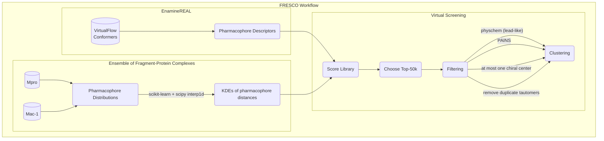

# Fragment Ensemble Scoring (FRESCO)

This repo contains code describing [Fragment Ensemble Scoring (FRESCO)](), a method for hit-finding from a fragment screen. FRESCO uses unsupervised machine learning to model a distribution of pharmacophore combinations in 3D space, which is then used to conduct a virtual screen on the EnamineREAL library for discovery of moelcular hits. This method is unique in directly predicting hit compounds from a fragment screen without any assaying of binding activity required, and has demonstrated success computationally on a retrospective analysis of COVID Moonshot compounds as well as in prospectively discovering hit compounds for both SARS-CoV-2 Mpro and SARS-CoV-2 nsp3-Mac1.

The repo contains all of the code necessary for fitting a model on fragment screen data and scoring molecules, but not the EnamineREAL datadue to storage limitations. Basic README files are present and full turotials for using FRESCO are work-in-progress!

## Workflow

