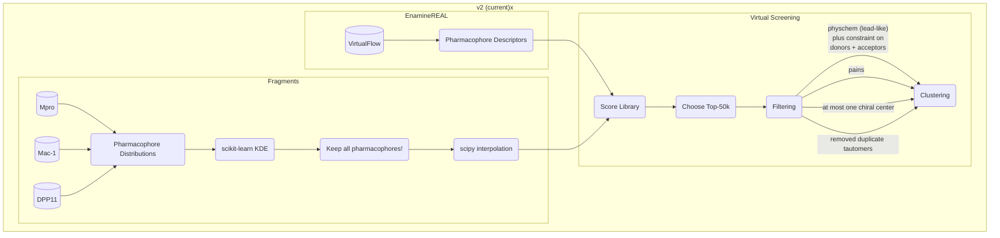

# Work journal for FRESCOE

Repo is work-in-progress, getting cleaned in preparation for preprint upload!

Fragment Ensemble Significant PharmaCOphore Extraction (FRESCOE) method for hit-finding from a fragment screen. FRESCOE uses unsupervised machine learning to model a distribution of pharmacophore combinations in 3D space, which is then used to conduct a virtual screen on the EnamineREAL library for discovery of moelcular hits. This method is unique in directly predicting hit compounds from a fragment screen without any assaying of binding activity required, and has demonstrated success computationally on a retrospective analysis of COVID Moonshot compounds as well as suggesting an experimentally validated novel scaffold for inhibiting the SARS-CoV-2 protease.

## Flowcharts

