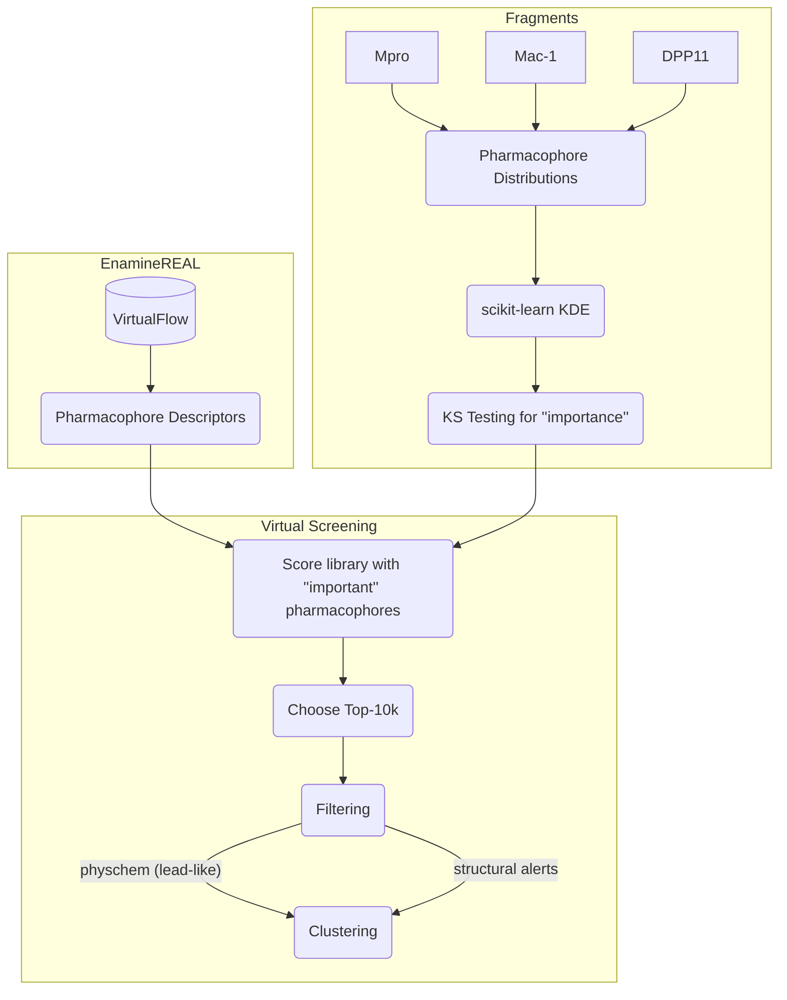

# Flowchart for FRESCO code - v1

```mermaid
flowchart TD
subgraph EnamineREAL
A[(VirtualFlow)] --> B(Pharmacophore Descriptors)
end

subgraph Fragments
Mpro --> PharmD(Pharmacophore Distributions)
Mac-1 --> PharmD
DPP11 --> PharmD
PharmD --> KDExact(scikit-learn KDE)
KDExact --> KDE(KS Testing for ''importance'')
end

subgraph Virtual Screening
B --> Score(Score library with ''important'' pharmacophores)
KDE --> Score
Score --> Choose(Choose Top-10k)
Choose --> G(Filtering)
G -- "physchem (lead-like)" --> H(Clustering)
G -- structural alerts --> H

end
```